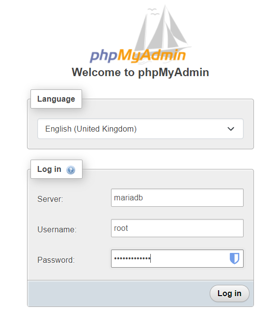

# Local WordPress with WooCommerce Development Environment

This repository provides a convenient way to set up a local development environment for WordPress with WooCommerce using Docker and Docker Compose.

## Introduction

This setup utilizes Docker containers to create a self-contained environment that closely resembles a production server. The benefits of using Docker for local development include:

- **Consistency:** Ensures a consistent development environment across different machines.
- **Isolation:** Prevents conflicts between different projects or dependencies.
- **Portability:** Easily share and move the development environment.
- **Speed:** Quickly start and stop the environment without affecting your host system.

## Prerequisites

Before you begin, make sure you have the following installed:

- **Docker:** [https://docs.docker.com/get-docker/](https://docs.docker.com/get-docker/)
- **Docker Compose:** [https://docs.docker.com/compose/install/](https://docs.docker.com/compose/install/)

## Getting Started

### 1. Clone this repository

```bash
git clone https://your-github-repository-url.git
cd your-repository-name
```

### 2. Create a .env file

- Duplicate the provided .env.example file and rename it to .env.
- Replace the placeholder values with your actual database credentials:

```ini
MYSQL_ROOT_PASSWORD=your_strong_root_password
MYSQL_USER=wordpress_user
MYSQL_PASSWORD=your_strong_password
```

### 3. Start the Environment

```bash
docker-compose up -d
```

### 4. Access the Websites

- WordPress: http://localhost
- phpMyAdmin: http://localhost:8080

In phpMyAdmin, use the server name "mariadb", username "root", and the password you set in the .env file (MYSQL_ROOT_PASSWORD).


## Additional Notes
- ***Data Persistence:***: The MariaDB (MySQL) data is stored in a named Docker volume (mariadb-data), so it will persist even if you stop or remove the containers.
- ***Customization:*** Feel free to modify the docker-compose.yml file to suit your specific needs, such as changing ports or using different Docker images.
- ***Security:*** Remember to keep your database credentials secure and avoid exposing phpMyAdmin to the public internet.

**Remember:**

- Replace the placeholders (`your-github-repository-url`, `your-repository-name`, `your_strong_root_password`, etc.) with your actual information.
- Don't forget to add the contents of your `docker-compose.yml` and `.env.example` files to the respective code blocks in the `README.md`.
- Consider adding more details to your README, such as how to install WordPress themes and plugins, how to customize the setup further, or how to troubleshoot common issues.

## Be patient
The first time you run the `docker-compose up -d` command, it may take a few minutes to download the necessary Docker images and set up the containers.
It also takes some time to install WordPress and WooCommerce, so be patient and wait for the process to complete.
Look for this entry `WooCommerce installation complete` in the Wordpress container log:

```
2024-07-17 16:46:30 WordPress is installed. Proceeding with WooCommerce setup.
2024-07-17 16:46:32 Installing and activating WooCommerce...
...
2024-07-17 16:46:34 Installing WooCommerce (9.1.2)
2024-07-17 16:46:34 Downloading installation package from https://downloads.wordpress.org/plugin/woocommerce.9.1.2.zip...
2024-07-17 16:46:37 Unpacking the package...
....
2024-07-17 16:47:22 Installing the plugin...
2024-07-17 16:47:26 Plugin installed successfully.
2024-07-17 16:47:26 Activating 'woocommerce'...
....
2024-07-17 16:47:31 Plugin 'woocommerce' activated.
2024-07-17 16:47:31 Success: Installed 1 of 1 plugins.
2024-07-17 16:47:31 WooCommerce installation complete.

```

## How to remove the MariaDb volume and start fresh?
Stop the containers first, delete the MariaDb instance and then run the following command to remove the MariaDB volume:
```bash
docker volume rm wordpress-local-containers_mariadb-data
```


Let me know if you have any other questions!

